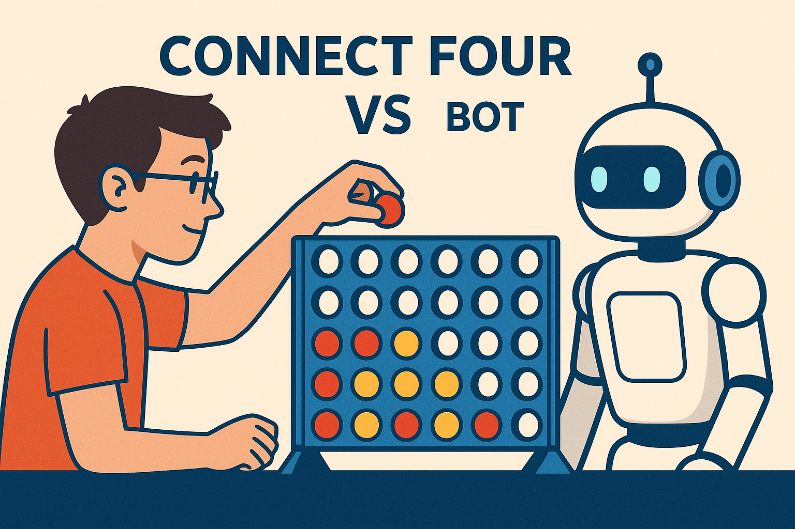

# Connect Four Lab


**C++ Programming Lab**
**Points**: 200
**Timeline**: 2 weeks
**Final Evaluation**: Tournament Playoff

---

## 📘 Overview

Your task is to build a **text-based Connect Four game** using C++.

Players will take turns dropping pieces into a vertical grid. The first player to get **four in a row** (horizontally, vertically, or diagonally) wins the game. Your program will manage the board, enforce the rules, check for wins, and provide a smooth user experience in the terminal.

This lab gives you hands-on practice with **2D arrays**, **looping**, **decision structures**, **functions**, and a **computer-controlled opponent**. The lab concludes with a **Connect Four tournament**, where your AI will compete head-to-head against your classmates’ programs in a single-elimination bracket.

---

## 🗓️ Schedule & Deliverables

* **Lab assigned** – begin planning and designing your board and logic
* **Check-in with instructor** – explain your function breakdown, AI strategy, and game structure *(required)*
* **Final code due** – submit your completed source files via GitHub and Canvas
* **Tournament begins** – bring your code to class and prepare for battle!

---

## 🎯 Requirements

* Display a **6-row by 7-column board** initialized with empty markers (e.g., `.`)
* Alternate turns between a **human player** and a **computer-controlled player (AI)**
* Allow players to select a column to "drop" their piece into
* Drop the piece to the **lowest available row** in that column
* Detect and report a **winning condition** (4 in a row)
* Detect and report a **tie game** (board is full, no winner)
* Use **clear function decomposition** (see below)
* Validate inputs and **re-prompt the user** if:

  * The input is invalid (non-numeric, out of range)
  * The selected column is already full

* Use **loops and decisions** throughout the game flow
* Include **at least 5 user-defined functions**, such as:

  * `void printBoard(char board[6][7]);`
  * `bool makeMove(char board[6][7], int col, char player);`
  * `bool checkWin(char board[6][7], char player);`
  * `bool isFull(char board[6][7]);`
  * `int getValidColumn();`

* Implement a **Computer Player (AI)**:

* The **minimum requirement** is a computer player that selects a column **randomly** from available columns.
* You are encouraged to go further:

    * Block the opponent if they are about to win
    * Make a winning move if one is available
    * Use a **scoring heuristic** to choose the best move

* Be fully playable from the terminal
* Include a function such as:

```cpp
int getAIMove(char board[6][7], char aiSymbol, char opponentSymbol);
```

---

## 🏆 Tournament Format (20 points)

At the end of the lab period, we will hold a **Connect Four Tournament**.

* Your **AI will play against other students' AIs** in a single-elimination bracket.
* For each match, your program will take turns calling and receiving moves from an opponent’s logic.
* Matches are run on a shared tournament driver, overseen by the instructor.
* You will advance **only if your AI wins** (tie = both eliminated).
* **Top 4 finishers** may earn additional recognition and bragging rights.

**Note**: Tournament results do not affect your score beyond the fixed 20 points for participation.

---

## 📂 Final Deliverables

Submit the following:

1. `main.cpp` and any supporting `.cpp` or `.h` files
2. A `Report.md` that includes:

    * Your name
    * How to compile and run the game
    * A brief summary of how your code is organized, including your AI strategy

---

## 🧾 Grading Breakdown (200 Points)

> **Note**: This lab is **graded in person with the instructor**. There is **no autograder**, code structure and development are up to you this time.
> You must be prepared to **walk through your code** and explain how it works to receive credit.

| Category                               | Points  |
| -------------------------------------- | ------- |
| Check-in with instructor               | 20      |
| Functional 6×7 board with valid moves  | 20      |
| Input validation and re-prompting      | 20      |
| Win condition detection                | 30      |
| Tie game detection                     | 10      |
| At least 5 user-defined functions      | 20      |
| AI player (minimum: random valid move) | 30      |
| Code clarity and commenting            | 30      |
| Clear, readable output                 | 20      |
| **Tournament participation**           | **20**  |
| **Total**                              | **200** |

---

## 💬 Tips for Success

* Build for two human players first, then add AI functionality.
* Your AI doesn’t need to be smart to compete—it just needs to be valid.
* Use `rand()` with `srand(time(0))` to generate random numbers.
* Validate player **and AI moves** to avoid invalid column choices.
* Modularize your logic—*don’t put everything in `main()`*.
* Test thoroughly, and come to the tournament prepared for edge cases!


## Turning it in
* Commit all your code
* Push your code to GitHub
* Submit our GitHub repository URL on Canvas
